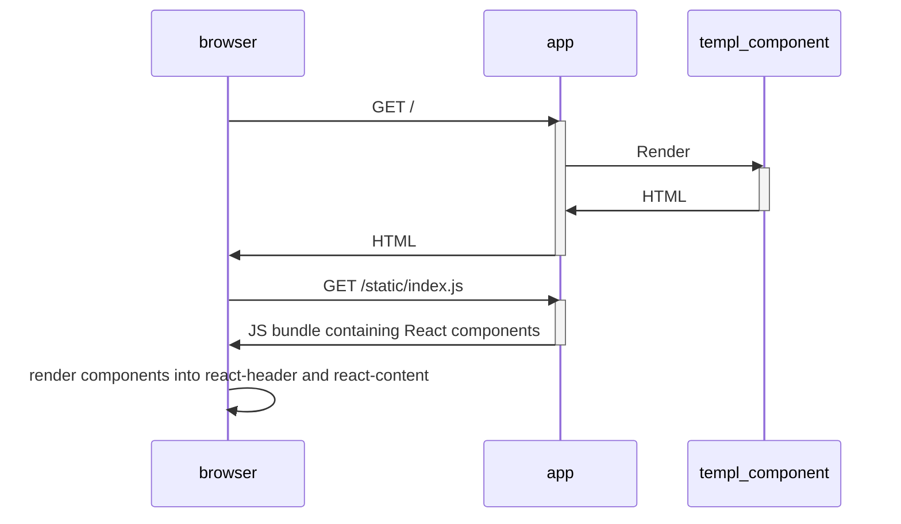

# Basic syntax

## Package name and imports

templ files start with a package name, followed by any required imports, just like Go.

```go
package main

import "fmt"
import "time"
```

## Components

templ files can also contain components. Components are markup and code that is compiled into functions that return a `templ.Component` interface by running the `templ generate` command.

Components can contain templ elements that render HTML, text, expressions that output text or include other templates, and branching statements such as `if` and `switch`, and `for` loops.

```templ name="header.templ"
package main

templ headerTemplate(name string) {
  <header data-testid="headerTemplate">
    <h1>{ name }</h1>
  </header>
}
```

## Go code

Outside of templ Components, templ files are ordinary Go code.

```templ name="header.templ"
package main

// Ordinary Go code that we can use in our Component.
var greeting = "Welcome!"

// templ Component
templ headerTemplate(name string) {
  <header>
    <h1>{ name }</h1>
    <h2>"{ greeting }" comes from ordinary Go code</h2>
  </header>
}
```


# Elements

templ elements are used to render HTML within templ components.

```templ title="button.templ"
package main

templ button(text string) {
	<button class="button">{ text }</button>
}
```

```go title="main.go"
package main

import (
	"context"
	"os"
)

func main() {
	button("Click me").Render(context.Background(), os.Stdout)
}
```

```html title="Output"
<button class="button">
 Click me
</button>
```

:::info
templ automatically minifies HTML responses, output is shown formatted for readability.
:::

## Tags must be closed

Unlike HTML, templ requires that all HTML elements are closed with either a closing tag (`</a>`), or by using a self-closing element (`<hr/>`).

templ is aware of which HTML elements are "void", and will not include the closing `/` in the output HTML.

```templ title="button.templ"
package main

templ component() {
	<div>Test</div>
	
	<br/>
}
```

```templ title="Output"
<div>Test</div>

<br>
```

## Attributes and elements can contain expressions

templ elements can contain placeholder expressions for attributes and content.

```templ title="button.templ"
package main

templ button(name string, content string) {
	<button value={ name }>{ content }</button>
}
```

Rendering the component to stdout, we can see the results.

```go title="main.go"
func main() {
	component := button("John", "Say Hello")
	component.Render(context.Background(), os.Stdout)
}
```

```html title="Output"
<button value="John">Say Hello</button>
```


# Attributes

## Constant attributes

templ elements can have HTML attributes that use the double quote character `"`.

```templ
templ component() {
  <p data-testid="paragraph">Text</p>
}
```

```html title="Output"
<p data-testid="paragraph">Text</p>
```

## String expression attributes

Element attributes can be set to Go strings.

```templ
templ component(testID string) {
  <p data-testid={ testID }>Text</p>
}

templ page() {
  @component("testid-123")
}
```

Rendering the `page` component results in:

```html title="Output"
<p data-testid="testid-123">Text</p>
```

:::note
String values are automatically HTML attribute encoded. This is a security measure, but may make the values (especially JSON appear) look strange to you, since some characters may be converted into HTML entities. However, it is correct HTML and won't affect the behavior. 
:::

It's also possible to use function calls in string attribute expressions.

Here's a function that returns a string based on a boolean input.

```go
func testID(isTrue bool) string {
    if isTrue {
        return "testid-123"
    }
    return "testid-456"
}
```

```templ
templ component() {
  <p data-testid={ testID(true) }>Text</p>
}
```

The result:

```html title="Output"
<p data-testid="testid-123">Text</p>
```

Functions in string attribute expressions can also return errors.

```go
func testID(isTrue bool) (string, error) {
    if isTrue {
        return "testid-123", nil
    }
    return "", fmt.Errorf("isTrue is false")
}
```

If the function returns an error, the `Render` method will return the error along with its location.

## Boolean attributes

Boolean attributes (see https://html.spec.whatwg.org/multipage/common-microsyntaxes.html#boolean-attributes) where the presence of an attribute name without a value means true, and the attribute name not being present means false are supported.

```templ
templ component() {
  <hr noshade/>
}
```

```html title="Output"
<hr noshade>
```

:::note
templ is aware that `<hr/>` is a void element, and renders `<hr>` instead.
:::


To set boolean attributes using variables or template parameters, a question mark after the attribute name is used to denote that the attribute is boolean.

```templ
templ component() {
  <hr noshade?={ false } />
}
```

```html title="Output"
<hr>
```

## Conditional attributes

Use an `if` statement within a templ element to optionally add attributes to elements.

```templ
templ component() {
  <hr style="padding: 10px"
    if true {
      class="itIsTrue"
    }
  />
}
```

```html title="Output"
<hr style="padding: 10px" class="itIsTrue" />
```

## Spread attributes

Use the `{ attrMap... }` syntax in the open tag of an element to append a dynamic map of attributes to the element's attributes.

It's possible to spread any variable of type `templ.Attributes`. `templ.Attributes` is a `map[string]any` type definition.

* If the value is a `string`, the attribute is added with the string value, e.g. `<div name="value">`.
* If the value is a `bool`, the attribute is added as a boolean attribute if the value is true, e.g. `<div name>`.
* If the value is a `templ.KeyValue[string, bool]`, the attribute is added if the boolean is true, e.g. `<div name="value">`.
* If the value is a `templ.KeyValue[bool, bool]`, the attribute is added if both boolean values are true, as `<div name>`.

```templ
templ component(shouldBeUsed bool, attrs templ.Attributes) {
  <p { attrs... }>Text</p>
  <hr
    if shouldBeUsed {
      { attrs... }
    }
  />
}

templ usage() {
  @component(false, templ.Attributes{"data-testid": "paragraph"}) 
}
```

```html title="Output"
<p data-testid="paragraph">Text</p>
<hr>
```

## URL attributes

The `<a>` element's `href` attribute is treated differently. templ expects you to provide a `templ.SafeURL` instead of a `string`.

Typically, you would do this by using the `templ.URL` function.

The `templ.URL` function sanitizes input URLs and checks that the protocol is `http`/`https`/`mailto` rather than `javascript` or another unexpected protocol.

```templ
templ component(p Person) {
  <a href={ templ.URL(p.URL) }>{ strings.ToUpper(p.Name) }</a>
}
```

:::tip
In templ, all attributes are HTML-escaped. This means that:

- `&` characters in the URL are escaped to `&amp;`.
- `"` characters are escaped to `&quot;`.
- `'` characters are escaped to `&#39;`.

This done to prevent XSS attacks. For example, without escaping, if a string contained `http://google.com" onclick="alert('hello')"`, the browser would interpret this as a URL followed by an `onclick` attribute, which would execute JavaScript code.

The escaping does not change the URL's functionality.

Sanitization is the process of examining the URL scheme (protocol) and structure to ensure that it's safe to use, e.g. that it doesn't contain `javascript:` or other potentially harmful schemes. If a URL is not safe, templ will replace the URL with `about:invalid#TemplFailedSanitizationURL`.
:::

The `templ.URL` function only supports standard HTML elements and attributes (`<a href=""` and `<form action=""`).

For use on non-standard HTML elements (e.g. HTMX's `hx-*` attributes), convert the `templ.URL` to a `string` after sanitization.

```templ
templ component(contact model.Contact) {
  <div hx-get={ string(templ.URL(fmt.Sprintf("/contacts/%s/email", contact.ID)))}>
    { contact.Name }
  </div>
}
```

:::caution
If you need to bypass this sanitization, you can use `templ.SafeURL(myURL)` to mark that your string is safe to use.

This may introduce security vulnerabilities to your program.
:::

## JavaScript attributes

`onClick` and other `on*` handlers have special behaviour, they expect a reference to a `script` template.

:::info
This ensures that any client-side JavaScript that is required for a component to function is only emitted once, that script name collisions are not possible, and that script input parameters are properly sanitized.
:::

```templ
script withParameters(a string, b string, c int) {
	console.log(a, b, c);
}

script withoutParameters() {
	alert("hello");
}

templ Button(text string) {
	<button onClick={ withParameters("test", text, 123) } onMouseover={ withoutParameters() } type="button">{ text }</button>
}
```

```html title="Output"
<script>
 function __templ_withParameters_1056(a, b, c){console.log(a, b, c);}function __templ_withoutParameters_6bbf(){alert("hello");}
</script>
<button onclick="__templ_withParameters_1056("test","Say hello",123)" onmouseover="__templ_withoutParameters_6bbf()" type="button">
 Say hello
</button>
```

## CSS attributes

CSS handling is discussed in detail in [CSS style management](/syntax-and-usage/css-style-management).

## JSON attributes

To set an attribute's value to a JSON string (e.g. for HTMX's [hx-vals](https://htmx.org/attributes/hx-vals) or Alpine's [x-data](https://alpinejs.dev/directives/data)), serialize the value to a string using a function.

```go
func countriesJSON() string {
	countries := []string{"Czech Republic", "Slovakia", "United Kingdom", "Germany", "Austria", "Slovenia"}
	bytes, _ := json.Marshal(countries)
	return string(bytes)
}
```

```templ
templ SearchBox() {
	<search-webcomponent suggestions={ countriesJSON() } />
}
```


# Expressions

## Interpolation expressions

Within a templ element, expressions can be used to interpolate go values. Content is automatically escaped using context-aware HTML encoding rules to protect against XSS and CSS injection attacks.

Literals, variables and functions that return a value can be used. 

The supported types for interpolation are:

- Strings
- Numbers (`int`, `uint`, `float32`, `complex64` etc.)
- Booleans

:::note
Any type based on the above list can be used, for example `type Age int` or `type Name string`.
:::

### Literals

You can use Go literals.

```templ title="component.templ"
package main

templ component() {
  <div>{ "print this" }</div>
  <div>{ `and this` }</div>
  <div>Number of the day: { 1 }</div>
}
```

```html title="Output"
<div>print this</div><div>and this</div><div>Number of the day: 1</div>
```

### Variables

Any supported Go variable can be used, for example:

* A function parameter.
* A field on a struct.
* A variable or constant that is in scope.

```templ title="/main.templ"
package main

templ greet(prefix string, p Person) {
  <div>{ prefix } { p.Name }{ exclamation }</div>
  <div>Congratulations on being { p.Age }!</div>
}
```

```templ title="main.go"
package main

type Person struct {
  Name string
  Age  int
}

const exclamation = "!"

func main() {
  p := Person{ Name: "John", Age: 42 }
  component := greet("Hello", p) 
  component.Render(context.Background(), os.Stdout)
}
```

```html title="Output"
<div>Hello John!</div><div>Congratulations on being 42!</div>
```

### Functions

Functions that return a value, or a value-error tuple can be used.

```templ title="component.templ"
package main

import "strings"
import "strconv"

func getString() (string, error) {
  return "DEF", nil
}

templ component() {
  <div>{ strings.ToUpper("abc") }</div>
  <div>{ getString() }</div>
}
```

```html title="Output"
<div>ABC</div>
<div>DEF</div>
```

If the function returns an error, the `Render` function will return an error containing the location of the error and the underlying error.

### Escaping

templ automatically escapes strings using HTML escaping rules.

```templ title="component.templ"
package main

templ component() {
  <div>{ `</div><script>alert('hello!')</script><div>` }</div>
}
```

```html title="Output"
<div>&lt;/div&gt;&lt;script&gt;alert(&#39;hello!&#39;)&lt;/script&gt;&lt;div&gt;</div>
```


# Statements

## Control flow

Within a templ element, a subset of Go statements can be used directly.

These Go statements can be used to conditionally render child elements, or to iterate variables.

For individual implementation guides see:

* [if/else](/syntax-and-usage/if-else)
* [switch](/syntax-and-usage/switch)
* [for loops](/syntax-and-usage/loops)

## if/switch/for within text

Go statements can be used without any escaping to make it simple for developers to include them.

The templ parser assumes that text that starts with `if`, `switch` or `for` denotes the start of one of those expressions as per this example.

```templ title="show-hello.templ"
package main

templ showHelloIfTrue(b bool) {
	<div>
		if b {
			<p>Hello</p>
		}
	</div>
}
```

If you need to start a text block with the words `if`, `switch`, or `for`:

* Use a Go string expression.
* Capitalise `if`, `switch`, or `for`.

```templ title="paragraph.templ"
package main

templ display(price float64, count int) {
	<p>Switch to Linux</p>
	<p>{ `switch to Linux` }</p>
	<p>{ "for a day" }</p>
	<p>{ fmt.Sprintf("%f", price) }{ "for" }{ fmt.Sprintf("%d", count) }</p>
	<p>{ fmt.Sprintf("%f for %d", price, count) }</p>
}
```

## Design considerations

We decided to not require a special prefix for `if`, `switch` and `for` expressions on the basis that we were more likely to want to use a Go control statement than start a text run with those strings.

To reduce the risk of a broken control statement, resulting in printing out the source code of the application, templ will complain if a text run starts with `if`, `switch` or `for`, but no opening brace `{` is found.

For example, the following code causes the templ parser to return an error:

```templ title="broken-if.templ"
package main

templ showIfTrue(b bool) {
	if b 
	  <p>Hello</p>
	}
}
```

:::note
Note the missing `{` on line 4.
:::

The following code also produces an error, since the text run starts with `if`, but no opening `{` is found.

```templ title="paragraph.templ"
package main

templ text(b bool) {
	<p>if a tree fell in the woods</p>
}
```

:::note
This also applies to `for` and `switch` statements.
:::

To resolve the issue:

* Use a Go string expression.
* Capitalise `if`, `switch`, or `for`.

```templ title="paragraph.templ"
package main

templ display(price float64, count int) {
	<p>Switch to Linux</p>
	<p>{ `switch to Linux` }</p>
	<p>{ "for a day" }</p>
	<p>{ fmt.Sprintf("%f", price) }{ "for" }{ fmt.Sprintf("%d", count) }</p>
	<p>{ fmt.Sprintf("%f for %d", price, count) }</p>
}
```


# If/else

templ uses standard Go `if`/`else` statements which can be used to conditionally render components and elements.

```templ title="component.templ"
templ login(isLoggedIn bool) {
  if isLoggedIn {
    <div>Welcome back!</div>
  } else {
    <input name="login" type="button" value="Log in"/>
  }
}
```

```go title="main.go"
package main

import (
	"context"
	"os"
)

func main() {
	login(true).Render(context.Background(), os.Stdout)
}
```

```html title="Output"
<div>
 Welcome back!
</div>
```


# Switch

templ uses standard Go `switch` statements which can be used to conditionally render components and elements.

```templ title="component.templ"
package main

templ userTypeDisplay(userType string) {
	switch userType {
		case "test":
			<span>{ "Test user" }</span>
		case "admin":
			<span>{ "Admin user" }</span>
		default:
			<span>{ "Unknown user" }</span>
	}
}
```

```go title="main.go"
package main

import (
	"context"
	"os"
)

func main() {
	userTypeDisplay("Other").Render(context.Background(), os.Stdout)
}
```

```html title="Output"
<span>
 Unknown user
</span>
```


# For loops

Use the standard Go `for` loop for iteration.

```templ title="component.templ"
package main

templ nameList(items []Item) {
  <ul>
  for _, item := range items {
    <li>{ item.Name }</li>
  }
  </ul>
}
```

```html title="Output"
<ul>
  <li>A</li>
  <li>B</li>
  <li>C</li>
</ul>
```


# Raw Go

For some more advanced use cases it may be useful to write Go code statements in your template.

Use the `{{ ... }}` syntax for this.

## Variable declarations

Scoped variables can be created using this syntax, to reduce the need for multiple function calls.

```templ title="component.templ"
package main

templ nameList(items []Item) {
    {{ first := items[0] }}
    <p>
        { first.Name }
    </p>
}
```

```html title="Output"
<p>A</p>
```


# Template composition

Templates can be composed using the import expression.

```templ
templ showAll() {
	@left()
	@middle()
	@right()
}

templ left() {
	<div>Left</div>
}

templ middle() {
	<div>Middle</div>
}

templ right() {
	<div>Right</div>
}
```

```html title="Output"
<div>
 Left
</div>
<div>
 Middle
</div>
<div>
 Right
</div>
```

## Children

Children can be passed to a component for it to wrap.

```templ
templ showAll() {
	@wrapChildren() {
		<div>Inserted from the top</div>
	}
}

templ wrapChildren() {
	<div id="wrapper">
		{ children... }
	</div>
}
```

:::note
The use of the `{ children... }` expression in the child component.
:::

```html title="output"
<div id="wrapper">
 <div>
  Inserted from the top
 </div>
</div>
```

### Using children in code components

Children are passed to a component using the Go context. To pass children to a component using Go code, use the `templ.WithChildren` function.

```templ
package main

import (
  "context"
  "os"

  "github.com/a-h/templ"
)

templ wrapChildren() {
	<div id="wrapper">
		{ children... }
	</div>
}

func main() {
  contents := templ.ComponentFunc(func(ctx context.Context, w io.Writer) error {
    _, err := io.WriteString(w, "<div>Inserted from Go code</div>")
    return err
  })
  ctx := templ.WithChildren(context.Background(), contents)
  wrapChildren().Render(ctx, os.Stdout)
}
```

```html title="output"
<div id="wrapper">
 <div>
  Inserted from Go code
 </div>
</div>
```

To get children from the context, use the `templ.GetChildren` function.

```templ
package main

import (
  "context"
  "os"

  "github.com/a-h/templ"
)

func main() {
  contents := templ.ComponentFunc(func(ctx context.Context, w io.Writer) error {
    _, err := io.WriteString(w, "<div>Inserted from Go code</div>")
    return err
  })
  wrapChildren := templ.ComponentFunc(func(ctx context.Context, w io.Writer) error {
    children := templ.GetChildren(ctx)
    ctx = templ.ClearChildren(ctx)
    _, err := io.WriteString(w, "<div id=\"wrapper\">")
    if err != nil {
      return err
    }
    err = children.Render(ctx, w)
    if err != nil {
      return err
    }
    _, err = io.WriteString(w, "</div>")
    return err
  })
```

:::note
The `templ.ClearChildren` function is used to stop passing the children down the tree.
:::

## Components as parameters

Components can also be passed as parameters and rendered using the `@component` expression.

```templ
package main

templ heading() {
    <h1>Heading</h1>
}

templ layout(contents templ.Component) {
	<div id="heading">
		@heading()
	</div>
	<div id="contents">
		@contents
	</div>
}

templ paragraph(contents string) {
	<p>{ contents }</p>
}
```

```go title="main.go"
package main

import (
	"context"
	"os"
)

func main() {
	c := paragraph("Dynamic contents")
	layout(c).Render(context.Background(), os.Stdout)
}
```

```html title="output"
<div id="heading">
	<h1>Heading</h1>
</div>
<div id="contents">
	<p>Dynamic contents</p>
</div>
```

You can pass `templ` components as parameters to other components within templates using standard Go function call syntax.

```templ
package main

templ heading() {
    <h1>Heading</h1>
}

templ layout(contents templ.Component) {
	<div id="heading">
		@heading()
	</div>
	<div id="contents">
		@contents
	</div>
}

templ paragraph(contents string) {
	<p>{ contents }</p>
}

templ root() {
	@layout(paragraph("Dynamic contents"))
}
```

```go title="main.go"
package main

import (
	"context"
	"os"
)

func main() {
	root().Render(context.Background(), os.Stdout)
}
```

```html title="output"
<div id="heading">
	<h1>Heading</h1>
</div>
<div id="contents">
	<p>Dynamic contents</p>
</div>
```

## Joining Components

Components can be aggregated into a single Component using `templ.Join`.

```templ
package main

templ hello() {
	<span>hello</span>
}

templ world() {
	<span>world</span>
}

templ helloWorld() {
	@templ.Join(hello(), world())
}
```

```go title="main.go"
package main

import (
	"context"
	"os"
)

func main() {
	helloWorld().Render(context.Background(), os.Stdout)
}
```

```html title="output"
<span>hello</span><span>world</span>
```

## Sharing and re-using components

Since templ components are compiled into Go functions by the `go generate` command, templ components follow the rules of Go, and are shared in exactly the same way as Go code.

templ files in the same directory can access each other's components. Components in different directories can be accessed by importing the package that contains the component, so long as the component is exported by capitalizing its name.

:::tip
In Go, a _package_ is a collection of Go source files in the same directory that are compiled together. All of the functions, types, variables, and constants defined in one source file in a package are available to all other source files in the same package.

Packages exist within a Go _module_, defined by the `go.mod` file.
:::

:::note
Go is structured differently to JavaScript, but uses similar terminology. A single `.js` or `.ts` _file_ is like a Go package, and an NPM package is like a Go module.
:::

### Exporting components

To make a templ component available to other packages, export it by capitalizing its name.

```templ
package components

templ Hello() {
	<div>Hello</div>
}
```

### Importing components

To use a component in another package, import the package and use the component as you would any other Go function or type.

```templ
package main

import "github.com/a-h/templ/examples/counter/components"

templ Home() {
	@components.Hello()
}
```

:::tip
To import a component from another Go module, you must first import the module by using the `go get <module>` command. Then, you can import the component as you would any other Go package.
:::


# CSS style management

## HTML class and style attributes

The standard HTML `class` and `style` attributes can be added to components. Note the use of standard quotes to denote a static value.

```templ
templ button(text string) {
	<button class="button is-primary" style="background-color: red">{ text }</button>
}
```

```html title="Output"
<button class="button is-primary" style="background-color: red">
 Click me
</button>
```

## Style attribute

To use a variable in the style attribute, use braces to denote the Go expression.

```templ
templ button(style, text string) {
	<button style={ style }>{ text }</button>
}
```

You can pass multiple values to the `style` attribute. The results are all added to the output.

```templ
templ button(style1, style2 string, text string) {
	<button style={ style1, style2 }>{ text }</button>
}
```

The style attribute supports use of the following types:

* `string` - A string containing CSS properties, e.g. `background-color: red`.
* `templ.SafeCSS` - A value containing CSS properties and values that will not be sanitized, e.g. `background-color: red; text-decoration: underline`
* `map[string]string` - A map of string keys to string values, e.g. `map[string]string{"color": "red"}`
* `map[string]templ.SafeCSSProperty` - A map of string keys to values, where the values will not be sanitized.
* `templ.KeyValue[string, string]` - A single CSS key/value.
* `templ.KeyValue[string, templ.SafeCSSProperty` - A CSS key/value, but the value will not be sanitized.
* `templ.KeyValue[string, bool]` - A map where the CSS in the key is only included in the output if the boolean value is true.
* `templ.KeyValue[templ.SafeCSS, bool]` - A map where the CSS in the key is only included if the boolean value is true.

Finally, a function value that returns any of the above types can be used.

Go syntax allows you to pass a single function that returns a value and an error.

```templ
templ Page(userType string) {
	<div style={ getStyle(userType) }>Styled</div>
}

func getStyle(userType string) (string, error) {
   //TODO: Look up in something that might error.
   return "background-color: red", errors.New("failed")
}
```

Or multiple functions and values that return a single type.

```templ
templ Page(userType string) {
	<div style={ getStyle(userType), "color: blue" }>Styled</div>
}

func getStyle(userType string) (string) {
   return "background-color: red"
}
```

### Style attribute examples

#### Maps

Maps are useful when styles need to be dynamically computed based on component state or external inputs.

```templ
func getProgressStyle(percent int) map[string]string {
    return map[string]string{
        "width": fmt.Sprintf("%d%%", percent),
        "transition": "width 0.3s ease",
    }
}

templ ProgressBar(percent int) {
    <div style={ getProgressStyle(percent) } class="progress-bar">
        <div class="progress-fill"></div>
    </div>
}
```

```html title="Output (percent=75)"
<div style="transition:width 0.3s ease;width:75%;" class="progress-bar">
    <div class="progress-fill"></div>
</div>
```

#### KeyValue pattern

The `templ.KV` helper provides conditional style application in a more compact syntax.

```templ
templ TextInput(value string, hasError bool) {
    <input
        type="text"
        value={ value }
        style={
            templ.KV("border-color: #ff3860", hasError),
            templ.KV("background-color: #fff5f7", hasError),
            "padding: 0.5em 1em;",
        }
    >
}
```

```html title="Output (hasError=true)"
<input 
    type="text" 
    value="" 
    style="border-color: #ff3860; background-color: #fff5f7; padding: 0.5em 1em;">
```

#### Bypassing sanitization

By default, dynamic CSS values are sanitized to protect against dangerous CSS values that might introduce vulnerabilities into your application.

However, if you're sure, you can bypass sanitization by marking your content as safe with the `templ.SafeCSS` and `templ.SafeCSSProperty` types.

```templ
func calculatePositionStyles(x, y int) templ.SafeCSS {
    return templ.SafeCSS(fmt.Sprintf(
        "transform: translate(%dpx, %dpx);",
        x*2,  // Example calculation
        y*2,
    ))
}

templ DraggableElement(x, y int) {
    <div style={ calculatePositionStyles(x, y) }>
        Drag me
    </div>
}
```

```html title="Output (x=10, y=20)"
<div style="transform: translate(20px, 40px);">
    Drag me
</div>
```

### Pattern use cases

| Pattern | Best For | Example Use Case |
|---------|----------|------------------|
| **Maps** | Dynamic style sets requiring multiple computed values | Progress indicators, theme switching |
| **KeyValue** | Conditional style toggling | Form validation, interactive states |
| **Functions** | Complex style generation | Animations, data visualizations |
| **Direct Strings** | Simple static styles | Basic formatting, utility classes |

### Sanitization behaviour

By default, dynamic CSS values are sanitized to protect against dangerous CSS values that might introduce vulnerabilities into your application.

```templ
templ UnsafeExample() {
    <div style={ "background-image: url('javascript:alert(1)')" }>
        Dangerous content
    </div>
}
```

```html title="Output"
<div style="background-image:zTemplUnsafeCSSPropertyValue;">
    Dangerous content
</div>
```

These protections can be bypassed with the `templ.SafeCSS` and `templ.SafeCSSProperty` types.

```templ
templ SafeEmbed() {
    <div style={ templ.SafeCSS("background-image: url(/safe.png);") }>
        Trusted content
    </div>
}
```

```html title="Output"
<div style="background-image: url(/safe.png);">
    Trusted content
</div>
```

:::note
HTML attribute escaping is not bypassed, so `<`, `>`, `&` and quotes will always appear as HTML entities (`&lt;` etc.) in attributes - this is good practice, and doesn't affect how browsers use the CSS.
:::

### Error Handling

Invalid values are automatically sanitized:

```templ
templ InvalidButton() {
    <button style={ 
        map[string]string{
            "": "invalid-property",
            "color": "</style>",
        }
    }>Click me</button>
}
```

```html title="Output"
<button style="zTemplUnsafeCSSPropertyName:zTemplUnsafeCSSPropertyValue;color:zTemplUnsafeCSSPropertyValue;">
    Click me
</button>
```

Go's type system doesn't support union types, so it's not possible to limit the inputs to the style attribute to just the supported types.

As such, the attribute takes `any`, and executes type checks at runtime. Any invalid types will produce the CSS value `zTemplUnsupportedStyleAttributeValue:Invalid;`.

## Class attributes

To use a variable as the name of a CSS class, use a CSS expression.

```templ title="component.templ"
package main

templ button(text string, className string) {
	<button class={ className }>{ text }</button>
}
```

The class expression can take an array of values.

```templ title="component.templ"
package main

templ button(text string, className string) {
	<button class={ "button", className }>{ text }</button>
}
```

### Dynamic class names

Toggle addition of CSS classes to an element based on a boolean value by passing:

* A `string` containing the name of a class to apply.
* A `templ.KV` value containing the name of the class to add to the element, and a boolean that determines whether the class is added to the attribute at render time.
  * `templ.KV("is-primary", true)`
  * `templ.KV("hover:red", true)`
* A map of string class names to a boolean that determines if the class is added to the class attribute value at render time:
  * `map[string]bool`
  * `map[CSSClass]bool`

```templ title="component.templ"
package main

css red() {
	background-color: #ff0000;
}

templ button(text string, isPrimary bool) {
	<button class={ "button", templ.KV("is-primary", isPrimary), templ.KV(red(), isPrimary) }>{ text }</button>
}
```

```go title="main.go"
package main

import (
	"context"
	"os"
)

func main() {
	button("Click me", false).Render(context.Background(), os.Stdout)
}
```

```html title="Output"
<button class="button">
 Click me
</button>
```

## CSS elements

The standard `<style>` element can be used within a template.

`<style>` element contents are rendered to the output without any changes.

```templ
templ page() {
	<style type="text/css">
		p {
			font-family: sans-serif;
		}
		.button {
			background-color: black;
			foreground-color: white;
		}
	</style>
	<p>
		Paragraph contents.
	</p>
}
```

```html title="Output"
<style type="text/css">
	p {
		font-family: sans-serif;
	}
	.button {
		background-color: black;
		foreground-color: white;
	}
</style>
<p>
	Paragraph contents.
</p>
```

:::tip
If you want to make sure that the CSS element is only output once, even if you use a template many times, use a CSS expression.
:::

## CSS components

When developing a component library, it may not be desirable to require that specific CSS classes are present when the HTML is rendered.

There may be CSS class name clashes, or developers may forget to include the required CSS.

To include CSS within a component library, use a CSS component.

CSS components can also be conditionally rendered.

```templ title="component.templ"
package main

var red = "#ff0000"
var blue = "#0000ff"

css primaryClassName() {
	background-color: #ffffff;
	color: { red };
}

css className() {
	background-color: #ffffff;
	color: { blue };
}

templ button(text string, isPrimary bool) {
	<button class={ "button", className(), templ.KV(primaryClassName(), isPrimary) }>{ text }</button>
}
```

```html title="Output"
<style type="text/css">
 .className_f179{background-color:#ffffff;color:#ff0000;}
</style>
<button class="button className_f179">
 Click me
</button>
```

:::info
The CSS class is given a unique name the first time it is used, and only rendered once per HTTP request to save bandwidth.
:::

:::caution
The class name is autogenerated, don't rely on it being consistent.
:::

### CSS component arguments

CSS components can also require function arguments.

```templ title="component.templ"
package main

css loading(percent int) {
	width: { fmt.Sprintf("%d%%", percent) };
}

templ index() {
    <div class={ loading(50) }></div>
    <div class={ loading(100) }></div>
}
```

```html title="Output"
<style type="text/css">
 .loading_a3cc{width:50%;}
</style>
<div class="loading_a3cc"></div>
<style type="text/css">
 .loading_9ccc{width:100%;}
</style>
<div class="loading_9ccc"></div>
```

### CSS Sanitization

To prevent CSS injection attacks, templ automatically sanitizes dynamic CSS property names and values using the `templ.SanitizeCSS` function. Internally, this uses a lightweight fork of Google's `safehtml` package to sanitize the value.

If a property name or value has been sanitized, it will be replaced with `zTemplUnsafeCSSPropertyName` for property names, or `zTemplUnsafeCSSPropertyValue` for property values.

To bypass this sanitization, e.g. for URL values of `background-image`, you can mark the value as safe using the `templ.SafeCSSProperty` type.

```templ
css windVaneRotation(degrees float64) {
	transform: { templ.SafeCSSProperty(fmt.Sprintf("rotate(%ddeg)", int(math.Round(degrees)))) };
}

templ Rotate(degrees float64) {
	<div class={ windVaneRotation(degrees) }>Rotate</div>
}
```

### CSS Middleware

The use of CSS templates means that `<style>` elements containing the CSS are rendered on each HTTP request.

To save bandwidth, templ can provide a global stylesheet that includes the output of CSS templates instead of including `<style>` tags in each HTTP request.

To provide a global stylesheet, use templ's CSS middleware, and register templ classes on application startup.

The middleware adds a HTTP route to the web server (`/styles/templ.css` by default) that renders the `text/css` classes that would otherwise be added to `<style>` tags when components are rendered. 

For example, to stop the `className` CSS class from being added to the output, the HTTP middleware can be used.

```go
c1 := className()
handler := NewCSSMiddleware(httpRoutes, c1)
http.ListenAndServe(":8000", handler)
```

:::caution
Don't forget to add a `<link rel="stylesheet" href="/styles/templ.css">` to your HTML to include the generated CSS class names!
:::


# Using JavaScript with templ

## Script tags

Use standard `<script>` tags, and standard HTML attributes to run JavaScript on the client.

```templ
templ body() {
  <script>
    function handleClick(event) {
      alert(event + ' clicked');
    }
  </script>
  <button onclick="handleClick(this)">Click me</button>
}
```

:::tip
To ensure that a `<script>` tag within a templ component is only rendered once per HTTP response (or context), use a [templ.OnceHandle](18-render-once.md).

Using a `templ.OnceHandle` allows a component to define global client-side scripts that it needs to run without including the scripts multiple times in the response.
:::

## Pass Go data to JavaScript

### Pass Go data to a JavaScript event handler

Use `templ.JSFuncCall` to pass server-side data to client-side scripts by calling a JavaScript function.

```templ title="input.templ"
templ Component(data CustomType) {
	<button onclick={ templ.JSFuncCall("alert", data.Message) }>Show alert</button>
}
```

The data passed to the `alert` function is JSON encoded, so if `data.Message` was the string value of `Hello, from the JSFuncCall data`, the output would be:

```html title="output.html"
<button onclick="alert('Hello, from the JSFuncCall data')">Show alert</button>
```

### Pass event objects to an Event Handler

HTML element `on*` attributes pass an event object to the function. To pass the event object to a function, use `templ.JSExpression`.


:::warning
`templ.JSExpression` bypasses JSON encoding, so the string value is output directly to the HTML - this can be a security risk if the data is not trusted, e.g. the data is user input, not a compile-time constant.
:::

```templ title="input.templ"
<script>
	function clickHandler(event, message) {
		alert(message);
		event.preventDefault();
	}
</script>
<button onclick={ templ.JSFuncCall("clickHandler", templ.JSExpression("event"), "message from Go") }>Show event</button>
```

The output would be:

```html title="output.html"
<script>
	function clickHandler(event, message) {
		alert(message);
		event.preventDefault();
	}
</script>
<button onclick="clickHandler(event, 'message from Go')">Show event</button>
```

### Call client side functions with server side data

Use `templ.JSFuncCall` to call a client-side function with server-side data.

`templ.JSFuncCall` takes a function name and a variadic list of arguments. The arguments are JSON encoded and passed to the function.

In the case that the function name is invalid (e.g. contains `</script>` or is a JavaScript expression, not a function name), the function name will be sanitized to `__templ_invalid_function_name`.

```templ title="components.templ"
templ InitializeClientSideScripts(data CustomType) {
  @templ.JSFuncCall("functionToCall", data.Name, data.Age)
}
```

This will output a `<script>` tag that calls the `functionToCall` function with the `Name` and `Age` properties of the `data` object.

```html title="output.html"
<script>
  functionToCall("John", 42);
</script>
```

:::tip
If you want to write out an arbitrary string containing JavaScript, and are sure it is safe, you can use `templ.JSUnsafeFuncCall` to bypass script sanitization.

Whatever string you pass to `templ.JSUnsafeFuncCall` will be output directly to the HTML, so be sure to validate the input.
:::

### Pass server-side data to the client in a HTML attribute

A common approach used by libraries like alpine.js is to pass data to the client in a HTML attribute.

To pass server-side data to the client in a HTML attribute, use `templ.JSONString` to encode the data as a JSON string.

```templ title="input.templ"
templ body(data any) {
  <button id="alerter" alert-data={ templ.JSONString(data) }>Show alert</button>
}
```

```html title="output.html"
<button id="alerter" alert-data="{&quot;msg&quot;:&quot;Hello, from the attribute data&quot;}">Show alert</button>
```

The data in the attribute can then be accessed from client-side JavaScript.

```javascript
const button = document.getElementById('alerter');
const data = JSON.parse(button.getAttribute('alert-data'));
```

[alpine.js](https://alpinejs.dev/) uses `x-*` attributes to pass data to the client:

```templ
templ DataDisplay(data DataType) {
  <div x-data={ templ.JSONString(data) }>
      ...
  </div>
}
```

### Pass server-side data to the client in a script element

In addition to passing data in HTML attributes, you can also pass data to the client in a `<script>` element.

```templ title="input.templ"
templ body(data any) {
  @templ.JSONScript("id", data)
}
```

```html title="output.html"
<script id="id" type="application/json">{"msg":"Hello, from the script data"}</script>
```

The data in the script tag can then be accessed from client-side JavaScript.

```javascript
const data = JSON.parse(document.getElementById('id').textContent);
```

### Interpolate Go data within JavaScript code in a script tag

If you want to use Go data as variables within JavaScript, you can use a `{{ value }}` block to place Go data within the script.

templ will automatically escape the Go data to prevent XSS attacks.

Within strings, you can use `{{ value }}` to interpolate Go data.

```templ title="input.templ"
templ body(msg string) {
  <script>
    const message = "Your message: {{ msg }}";
    alert(message);
  </script>
}
```

The output would be:

```html title="output.html" msg="Hello"
<script>
  const message = "Your message: Hello";
  alert(message);
</script>
```

Outside JavaScript strings, data is JSON encoded so that it can be used as a JavaScript object.

```templ title="input.templ"
templ body(msg string) {
  <script>
    const message = {{ msg }};
    alert(message);
  </script>
}
```

The output would be:

```html title="output.html" msg="Hello"
<script>
  const message = "Hello";
  alert(message);
</script>
```

:::tip
It's better to pass data to the client in a HTML attribute or a script tag, as this separates the data from the JavaScript code, making it easier to maintain and debug.
:::

## Avoiding inline event handlers

According to Mozilla, [inline event handlers are considered bad practice](https://developer.mozilla.org/en-US/docs/Learn_web_development/Core/Scripting/Events#inline_event_handlers_%E2%80%94_dont_use_these).

This example demonstrates how to add client-side behaviour to a component using a script tag.

The example uses a `templ.OnceHandle` to define global client-side scripts that are required, without rendering the scripts multiple times in the response.

```templ title="component.templ"
package main

import "net/http"

var helloHandle = templ.NewOnceHandle()

templ hello(label, name string) {
  // This script is only rendered once per HTTP request.
  @helloHandle.Once() {
    <script>
      function hello(name) {
        alert('Hello, ' + name + '!');
      }
    </script>
  }
  <div>
    <input type="button" value={ label } data-name={ name }/>
    <script>
      // To prevent the variables from leaking into the global scope,
      // this script is wrapped in an IIFE (Immediately Invoked Function Expression).
      (() => {
        let scriptElement = document.currentScript;
        let parent = scriptElement.closest('div');
        let nearestButtonWithName = parent.querySelector('input[data-name]');
        nearestButtonWithName.addEventListener('click', function() {
          let name = nearestButtonWithName.getAttribute('data-name');
          hello(name);
        })
      })()
    </script>
  </div>
}

templ page() {
  @hello("Hello User", "user")
  @hello("Hello World", "world")
}

func main() {
  http.Handle("/", templ.Handler(page()))
  http.ListenAndServe("127.0.0.1:8080", nil)
}
```

:::tip
You might find libraries like [surreal](https://github.com/gnat/surreal) useful for reducing boilerplate.

```templ
var helloHandle = templ.NewOnceHandle()
var surrealHandle = templ.NewOnceHandle()

templ hello(label, name string) {
  @helloHandle.Once() {
    <script>
      function hello(name) {
        alert('Hello, ' + name + '!');
      }
    </script>
  }
  @surrealHandle.Once() {
    <script src="https://cdn.jsdelivr.net/gh/gnat/surreal@3b4572dd0938ce975225ee598a1e7381cb64ffd8/surreal.js"></script>
  }
  <div>
    <input type="button" value={ label } data-name={ name }/>
    <script>
      // me("-") returns the previous sibling element.
      me("-").addEventListener('click', function() {
        let name = this.getAttribute('data-name');
        hello(name);
      })
    </script>
  </div>
}
```
:::

## Importing scripts

Use standard `<script>` tags to load JavaScript from a URL.

```templ
templ head() {
	<head>
		<script src="https://unpkg.com/lightweight-charts/dist/lightweight-charts.standalone.production.js"></script>
	</head>
}
```

And use the imported JavaScript directly in templ via `<script>` tags.

```templ
templ body() {
	<script>
		const chart = LightweightCharts.createChart(document.body, { width: 400, height: 300 });
		const lineSeries = chart.addLineSeries();
		lineSeries.setData([
				{ time: '2019-04-11', value: 80.01 },
				{ time: '2019-04-12', value: 96.63 },
				{ time: '2019-04-13', value: 76.64 },
				{ time: '2019-04-14', value: 81.89 },
				{ time: '2019-04-15', value: 74.43 },
				{ time: '2019-04-16', value: 80.01 },
				{ time: '2019-04-17', value: 96.63 },
				{ time: '2019-04-18', value: 76.64 },
				{ time: '2019-04-19', value: 81.89 },
				{ time: '2019-04-20', value: 74.43 },
		]);
	</script>
}
```

:::tip
You can use a CDN to serve 3rd party scripts, or serve your own and 3rd party scripts from your server using a `http.FileServer`.

```go
mux := http.NewServeMux()
mux.Handle("/assets/", http.StripPrefix("/assets/", http.FileServer(http.Dir("assets"))))
http.ListenAndServe("localhost:8080", mux)
```
:::

## Working with NPM projects

https://github.com/a-h/templ/tree/main/examples/typescript contains a TypeScript example that uses `esbuild` to transpile TypeScript into plain JavaScript, along with any required `npm` modules.

After transpilation and bundling, the output JavaScript code can be used in a web page by including a `<script>` tag.

### Creating a TypeScript project

Create a new TypeScript project with `npm`, and install TypeScript and `esbuild` as development dependencies.

```bash
mkdir ts
cd ts
npm init
npm install --save-dev typescript esbuild
```

Create a `src` directory to hold the TypeScript code.

```bash
mkdir src
```

And add a TypeScript file to the `src` directory.

```typescript title="ts/src/index.ts"
function hello() {
  console.log('Hello, from TypeScript');
}
```

### Bundling TypeScript code

Add a script to build the TypeScript code in `index.ts` and copy it to an output directory (in this case `./assets/js/index.js`).

```json title="ts/package.json"
{
  "name": "ts",
  "version": "1.0.0",
  "scripts": {
    "build": "esbuild --bundle --minify --outfile=../assets/js/index.js ./src/index.ts"
  },
  "devDependencies": {
    "esbuild": "0.21.3",
    "typescript": "^5.4.5"
  }
}
```

After running `npm build` in the `ts` directory, the TypeScript code is transpiled into JavaScript and copied to the output directory.

### Using the output JavaScript

The output file `../assets/js/index.js` can then be used in a templ project.

```templ title="components/head.templ"
templ head() {
	<head>
		<script src="/assets/js/index.js"></script>
	</head>
}
```

You will need to configure your Go web server to serve the static content.

```go title="main.go"
func main() {
	mux := http.NewServeMux()
	// Serve the JS bundle.
	mux.Handle("/assets/", http.StripPrefix("/assets/", http.FileServer(http.Dir("assets"))))

	// Serve components.
	data := map[string]any{"msg": "Hello, World!"}
	h := templ.Handler(components.Page(data))
	mux.Handle("/", h)

	fmt.Println("Listening on http://localhost:8080")
	http.ListenAndServe("localhost:8080", mux)
}
```

## Script templates

:::warning
Script templates are a legacy feature and are not recommended for new projects.

Use the `templ.JSFuncCall`, `templ.JSONString` and other features of templ alongside standard `<script>` tags to import standalone JavaScript files, optionally created by a bundler like `esbuild`.
:::

If you need to pass Go data to scripts, you can use a script template.

Here, the `page` HTML template includes a `script` element that loads a charting library, which is then used by the `body` element to render some data.

```templ
package main

script graph(data []TimeValue) {
	const chart = LightweightCharts.createChart(document.body, { width: 400, height: 300 });
	const lineSeries = chart.addLineSeries();
	lineSeries.setData(data);
}

templ page(data []TimeValue) {
	<html>
		<head>
			<script src="https://unpkg.com/lightweight-charts/dist/lightweight-charts.standalone.production.js"></script>
		</head>
		<body onload={ graph(data) }></body>
	</html>
}
```

The data is loaded by the backend into the template. This example uses a constant, but it could easily have collected the `[]TimeValue` from a database.

```go title="main.go"
package main

import (
	"fmt"
	"log"
	"net/http"
)

type TimeValue struct {
	Time  string  `json:"time"`
	Value float64 `json:"value"`
}

func main() {
	mux := http.NewServeMux()

	// Handle template.
	mux.HandleFunc("/", func(w http.ResponseWriter, r *http.Request) {
		data := []TimeValue{
			{Time: "2019-04-11", Value: 80.01},
			{Time: "2019-04-12", Value: 96.63},
			{Time: "2019-04-13", Value: 76.64},
			{Time: "2019-04-14", Value: 81.89},
			{Time: "2019-04-15", Value: 74.43},
			{Time: "2019-04-16", Value: 80.01},
			{Time: "2019-04-17", Value: 96.63},
			{Time: "2019-04-18", Value: 76.64},
			{Time: "2019-04-19", Value: 81.89},
			{Time: "2019-04-20", Value: 74.43},
		}
		page(data).Render(r.Context(), w)
	})

	// Start the server.
	fmt.Println("listening on :8080")
	if err := http.ListenAndServe(":8080", mux); err != nil {
		log.Printf("error listening: %v", err)
	}
}
```

`script` elements are templ Components, so you can also directly render the Javascript function, passing in Go data, using the `@` expression:

```templ
package main

import "fmt"

script printToConsole(content string) {
	console.log(content)
}

templ page(content string) {
	<html>
		<body>
		  @printToConsole(content)
		  @printToConsole(fmt.Sprintf("Again: %s", content))
		</body>
	</html>
}
```

The data passed into the Javascript function will be JSON encoded, which then can be used inside the function.

```go title="main.go"
package main

import (
	"fmt"
	"log"
	"net/http"
	"time"
)

func main() {
	mux := http.NewServeMux()

	// Handle template.
	mux.HandleFunc("/", func(w http.ResponseWriter, r *http.Request) {
		// Format the current time and pass it into our template
		page(time.Now().String()).Render(r.Context(), w)
	})

	// Start the server.
	fmt.Println("listening on :8080")
	if err := http.ListenAndServe(":8080", mux); err != nil {
		log.Printf("error listening: %v", err)
	}
}
```

After building and running the executable, running `curl http://localhost:8080/` would render:

```html title="Output"
<html>
	<body>
		<script>function __templ_printToConsole_5a85(content){console.log(content)}</script>
		<script>__templ_printToConsole_5a85("2023-11-11 01:01:40.983381358 +0000 UTC")</script>
		<script>__templ_printToConsole_5a85("Again: 2023-11-11 01:01:40.983381358 +0000 UTC")</script>
	</body>
</html>
```

The `JSExpression` type is used to pass arbitrary JavaScript expressions to a templ script template.

A common use case is to pass the `event` or `this` objects to an event handler.

```templ
package main

script showButtonWasClicked(event templ.JSExpression) {
	const originalButtonText = event.target.innerText
	event.target.innerText = "I was Clicked!"
	setTimeout(() => event.target.innerText = originalButtonText, 2000)
}

templ page() {
	<html>
		<body>
			<button type="button" onclick={ showButtonWasClicked(templ.JSExpression("event")) }>Click Me</button>
		</body>
	</html>
}
```


# Comments

# HTML comments

Inside templ statements, use HTML comments.

```templ title="template.templ"
templ template() {
	<!-- Single line -->
	<!--
		Single or multiline.
	-->
}
```

Comments are rendered to the template output.

```html title="Output"
<!-- Single line -->
<!--
	Single or multiline.
-->
```

As per HTML, nested comments are not supported.

# Go comments

Outside of templ statements, use Go comments.

```templ
package main

// Use standard Go comments outside templ statements.
var greeting = "Hello!"

templ hello(name string) {
	<p>{greeting} { name }</p>
}
```


# Context

## What problems does `context` solve?

### "Prop drilling"

It can be cumbersome to pass data from parents through to children components, since this means that every component in the hierarchy has to accept parameters and pass them through to children.

The technique of passing data through a stack of components is sometimes called "prop drilling".

In this example, the `middle` component doesn't use the `name` parameter, but must accept it as a parameter in order to pass it to the `bottom` component.

```templ title="component.templ"
package main

templ top(name string) {
	<div>
		@middle(name)
	</div>
}

templ middle(name string) {
	<ul>
		@bottom(name)
	</ul>
}

templ bottom(name string) {
  <li>{ name }</li>
}
```

:::tip
In many cases, prop drilling is the best way to pass data because it's simple and reliable.

Context is not strongly typed, and errors only show at runtime, not compile time, so it should be used sparingly in your application.
:::

### Coupling

Some data is useful for many components throughout the hierarchy, for example:

* Whether the current user is logged in or not.
* The username of the current user.
* The locale of the user (used for localization).
* Theme preferences (e.g. light vs dark).

One way to pass this information is to create a `Settings` struct and pass it through the stack as a parameter.

```templ title="component.templ"
package main

type Settings struct {
	Username string
	Locale   string
	Theme    string
}

templ top(settings Settings) {
	<div>
		@middle(settings)
	</div>
}

templ middle(settings Settings) {
	<ul>
		@bottom(settings)
	</ul>
}

templ bottom(settings Settings) {
  <li>{ settings.Theme }</li>
}
```

However, this `Settings` struct may be unique to a single website, and reduce the ability to reuse a component in another website, due to its tight coupling with the `Settings` struct.

## Using `context`

:::info
templ components have an implicit `ctx` variable within the scope. This `ctx` variable is the variable that is passed to the `templ.Component`'s `Render` method.
:::

To allow data to be accessible at any level in the hierarchy, we can use Go's built in `context` package.

Within templ components, use the implicit `ctx` variable to access the context.

```templ title="component.templ"
templ themeName() {
	<div>{ ctx.Value(themeContextKey).(string) }</div>
}
```

To allow the template to get the `themeContextKey` from the context, create a context, and pass it to the component's `Render` function.

```templ title="main.go"
// Define the context key type.
type contextKey string

// Create a context key for the theme.
var themeContextKey contextKey = "theme"

// Create a context variable that inherits from a parent, and sets the value "test".
ctx := context.WithValue(context.Background(), themeContextKey, "test")

// Pass the ctx variable to the render function.
themeName().Render(ctx, w)
```

:::warning
Attempting to access a context key that doesn't exist, or using an invalid type assertion will trigger a panic.
:::

### Tidying up

Rather than read from the context object directly, it's common to implement a type-safe function instead.

This is also required when the type of the context key is in a different package to the consumer of the context, and the type is private (which is usually the case).

```templ title="main.go"
func GetTheme(ctx context.Context) string {
	if theme, ok := ctx.Value(themeContextKey).(string); ok {
		return theme
	}
	return ""
}
```

This minor change makes the template code a little tidier.

```templ title="component.templ"
templ themeName() {
	<div>{ GetTheme(ctx) }</div>
}
```

:::note
As of v0.2.731, Go's built in `context` package is no longer implicitly imported into .templ files.
:::

## Using `context` with HTTP middleware

In HTTP applications, a common pattern is to insert HTTP middleware into the request/response chain.

Middleware can be used to update the context that is passed to other components. Common use cases for middleware include authentication, and theming.

By inserting HTTP middleware, you can set values in the context that can be read by any templ component in the stack for the duration of that HTTP request.

```templ title="component.templ"
type contextKey string
var contextClass = contextKey("class")

func Middleware(next http.Handler) http.Handler {
  return http.HandlerFunc(func (w http.ResponseWriter, r *http.Request ) {
    ctx := context.WithValue(r.Context(), contextClass, "red")
    next.ServeHTTP(w, r.WithContext(ctx))
  })
}

templ Page() {
  @Show()
}

templ Show() {
  <div class={ ctx.Value(contextClass) }>Display</div>
}

func main() {
  h := templ.Handler(Page())
  withMiddleware := Middleware(h)
  http.Handle("/", withMiddleware)
  http.ListenAndServe(":8080", h)
}
```

:::warning
If you write a component that relies on a context variable that doesn't exist, or is an unexpected type, your component will panic at runtime.

This means that if your component relies on HTTP middleware that sets the context, and you forget to add it, your component will panic at runtime.
:::


# Using with `html/template`

Templ components can be used with the Go standard library [`html/template`](https://pkg.go.dev/html/template) package.

## Using `html/template` in a templ component

To use an existing `html/template` in a templ component, use the `templ.FromGoHTML` function.

```templ title="component.templ"
package testgotemplates

import "html/template"

var goTemplate = template.Must(template.New("example").Parse("<div>{{ . }}</div>"))

templ Example() {
	<!DOCTYPE html>
	<html>
		<body>
			@templ.FromGoHTML(goTemplate, "Hello, World!")
		</body>
	</html>
}
```

```go title="main.go"
func main() {
	Example.Render(context.Background(), os.Stdout)
}
```

```html title="Output"
<!DOCTYPE html>
<html>
	<body>
		<div>Hello, World!</div>
	</body>
</html>
```

## Using a templ component with	`html/template`

To use a templ component within a `html/template`, use the `templ.ToGoHTML` function to render the component into a `template.HTML value`.

```templ title="component.html"
package testgotemplates

import "html/template"

var example = template.Must(template.New("example").Parse(`<!DOCTYPE html>
<html>
	<body>
		{{ . }}
	</body>
</html>
`))

templ greeting() {
	<div>Hello, World!</div>
}
```

```go title="main.go"
func main() {
	// Create the templ component.
	templComponent := greeting()

	// Render the templ component to a `template.HTML` value.
	html, err := templ.ToGoHTML(context.Background(), templComponent)
	if err != nil {
		t.Fatalf("failed to convert to html: %v", err)
	}

	// Use the `template.HTML` value within the text/html template.
	err = example.Execute(os.Stdout, html)
	if err != nil {
		t.Fatalf("failed to execute template: %v", err)
	}
}
```

```html title="Output"
<!DOCTYPE html>
<html>
	<body>
		<div>Hello, World!</div>
	</body>
</html>
```


# Rendering raw HTML

To render HTML that has come from a trusted source, bypassing all HTML escaping and security mechanisms that templ includes, use the `templ.Raw` function.

:::info
Only include HTML that comes from a trusted source.
:::

:::warning
Use of this function may introduce security vulnerabilities to your program.
:::

```templ title="component.templ"
templ Example() {
	<!DOCTYPE html>
	<html>
		<body>
			@templ.Raw("<div>Hello, World!</div>")
		</body>
	</html>
}
```

```html title="Output"
<!DOCTYPE html>
<html>
	<body>
		<div>Hello, World!</div>
	</body>
</html>
```


# Using React with templ

templ is great for server-side rendering. Combined with [HTMX](https://htmx.org/), it's even more powerful, since HTMX can be used to replace elements within the page with updated HTML fetched from the server, providing many of the benefits of React with reduced overall complexity. See [/server-side-rendering/htmx](/server-side-rendering/htmx) for an example.

However, React has a huge ecosystem of rich interactive components, so being able to tap into the ecosystem is very useful.

With templ, it's more likely that you will use React components as [islands of interactivity](https://www.patterns.dev/vanilla/islands-architecture/) rather than taking over all aspects of displaying your app, with templ taking over server-side rendering, but using React to provide specific features on the client side.

## Using React components

First, lets start by rendering simple React components.

### Create React components

To use React components in your templ app, create your React components using TSX (TypeScript) or JSX as usual.

```tsx title="react/components.tsx"
export const Header = () => (<h1>React component Header</h1>);

export const Body = () => (<div>This is client-side content from React</div>);
```

### Create a templ page

Next, use templ to create a page containing HTML elements with specific IDs.

:::note
This page defines elements with ids of `react-header` and `react-content`.

A `<script>` element loads in a JavaScript bundle that we haven't created yet.
:::

```templ title="components.templ"
package main

templ page() {
	<html>
		<body>
			<div id="react-header"></div>
			<div id="react-content"></div>
			<div>This is server-side content from templ.</div>
			<!-- Load the React bundle created using esbuild -->
			<script src="static/index.js"></script>
		</body>
	</html>
}
```

:::tip
Remember to run `templ generate` when you've finished writing your templ file.
:::

### Render React components into the IDs

Write TypeScript or JavaScript to render the React components into the HTML elements that are rendered by templ.

```typescript title="react/index.ts"
import { createRoot } from 'react-dom/client';
import { Header, Body } from './components';

// Render the React component into the templ page at the react-header.
const headerRoot = document.getElementById('react-header');
if (!headerRoot) {
	throw new Error('Could not find element with id react-header');
}
const headerReactRoot = createRoot(headerRoot);
headerReactRoot.render(Header());

// Add the body React component.
const contentRoot = document.getElementById('react-content');
if (!contentRoot) {
	throw new Error('Could not find element with id react-content');
}
const contentReactRoot = createRoot(contentRoot);
contentReactRoot.render(Body());
```

### Create a client-side bundle

To turn the JSX, TSX, TypeScript and JavaScript code into a bundle that can run in the browser, use a bundling tool.

https://esbuild.github.io/ is commonly used for this task. It's fast, it's easy to use, and it's written in Go.

Executing `esbuild` with the following arguments creates an `index.js` file in the static directory.

```bash
esbuild --bundle index.ts --outdir=../static --minify
```

### Serve the templ component and client side bundle

To serve the server-side rendered templ template, and the client-side JavaScript bundle created in the previous step, setup a Go web server.

```go title="main.go"
package main

import (
	"fmt"
	"log"
	"net/http"

	"github.com/a-h/templ"
)

func main() {
	mux := http.NewServeMux()

	// Serve the templ page.
	mux.Handle("/", templ.Handler(page()))

	// Serve static content.
	mux.Handle("/static/", http.StripPrefix("/static/", http.FileServer(http.Dir("static"))))

	// Start the server.
	fmt.Println("listening on localhost:8080")
	if err := http.ListenAndServe("localhost:8080", mux); err != nil {
		log.Printf("error listening: %v", err)
	}
}
```

### Results

Putting this together results in a web page that renders server-side HTML using templ. The server-side HTML includes a link to the static React bundle.



## Passing server-side data to React components

Moving on from the previous example, it's possible to pass data to client-side React components.

### Add a React component that accepts data arguments

First, add a new component.

```tsx title="react/components.tsx"
export const Hello = (name: string) => (
  <div>Hello {name} (Client-side React, rendering server-side data)</div>
);
```

### Export a JavaScript function that renders the React component to a HTML element

```typescript title="react/index.ts"
// Update the import to add the new Hello React component.
import { Header, Body, Hello } from './components';

// Previous script contents...
  
export function renderHello(e: HTMLElement) {
  const name = e.getAttribute('data-name') ?? "";
  createRoot(e).render(Hello(name));
}
```

### Update the templ component to use the new function

Now that we have a `renderHello` function that will render the React component to the given element, we can update the templ components to use it.

In templ, we can add a `Hello` component that does two things:

1. Renders an element for the React component to be loaded into that sets the `data-name` attribute to the value of the server-side `name` field.
2. Writes out JS that calls the `renderHello` function to mount the React component into the element.

:::note
The template renders three copies of the `Hello` React component, passing in a distinct `name` parameter ("Alice", "Bob" and "Charlie").
:::

```templ title="components.templ"
package main

import "fmt"

templ Hello(name string) {
	<div data-name={ name }>
		<script>
			bundle.renderHello(document.currentScript.closest('div'));
		</script>
	</div>
}

templ page() {
	<html>
		<head>
			<title>React integration</title>
		</head>
		<body>
			<div id="react-header"></div>
			<div id="react-content"></div>
			<div>
				This is server-side content from templ.
			</div>
			<!-- Load the React bundle that was created using esbuild -->
			<!-- Since the bundle was coded to expect the react-header and react-content elements to exist already, in this case, the script has to be loaded after the elements are on the page -->
			<script src="static/index.js"></script>
			<!-- Now that the React bundle is loaded, we can use the functions that are in it -->
			<!-- the renderName function in the bundle can be used, but we want to pass it some server-side data -->
			for _, name := range []string{"Alice", "Bob", "Charlie"} {
				@Hello(name)
			}
		</body>
	</html>
}
```

### Update the `esbuild` command

The `bundle` namespace in JavaScript is created by adding a `--global-name` argument to `esbuild`. The argument causes any exported functions in `index.ts` to be added to that namespace.

```bash
esbuild --bundle index.ts --outdir=../static --minify --global-name=bundle
```

### Results

The HTML that's rendered is:

```html
<html>
  <head>
    <title>React integration</title>
  </head>
  <body>
    <div id="react-header"></div>
    <div id="react-content"></div>
    <div>This is server-side content from templ.</div>

    <script src="static/index.js"></script>

    <div data-name="Alice">
      <script>
        // Place the React component into the parent div.
        bundle.renderHello(document.currentScript.closest('div'));
      </script>
    </div>
    <div data-name="Bob">
      <script>
        // Place the React component into the parent div.
	bundle.renderHello(document.currentScript.closest('div'));
      </script>
    </div>
    <div data-name="Charlie">
      <script>
        // Place the React component into the parent div.
	bundle.renderHello(document.currentScript.closest('div'));
      </script>
    </div>
  </body>
</html>
```

And the browser shows the expected content after rendering the client side React components.

```
React component Header
This is client-side content from React
This is server-side content from templ.
Hello Alice (Client-side React, rendering server-side data)
Hello Bob (Client-side React, rendering server-side data)
Hello Charlie (Client-side React, rendering server-side data)
```

## Example code

See https://github.com/a-h/templ/tree/main/examples/integration-react for a complete example.


# Render once

If you need to render something to the page once per page, you can create a `*OnceHandler` with `templ.NewOnceHandler()` and use its `Once()` method.

The `*OnceHandler.Once()` method ensures that the content is only rendered once per distinct context passed to the component's `Render` method, even if the component is rendered multiple times.

## Example

The `hello` JavaScript function is only rendered once, even though the `hello` component is rendered twice.

:::warning
Dont write `@templ.NewOnceHandle().Once()` - this creates a new `*OnceHandler` each time the `Once` method is called, and will result in the content being rendered multiple times.
:::

```templ title="component.templ"
package once

var helloHandle = templ.NewOnceHandle()

templ hello(label, name string) {
  @helloHandle.Once() {
    <script>
      function hello(name) {
        alert('Hello, ' + name + '!');
      }
    </script>
  }
  <input type="button" value={ label } data-name={ name } onclick="hello(this.getAttribute('data-name'))"/>
}

templ page() {
  @hello("Hello User", "user")
  @hello("Hello World", "world")
}
```

```html title="Output"
<script>
  function hello(name) {
    alert('Hello, ' + name + '!');
  }
</script>
<input type="button" value="Hello User" data-name="user" onclick="hello(this.getAttribute('data-name'))">
<input type="button" value="Hello World" data-name="world" onclick="hello(this.getAttribute('data-name'))">
```

:::tip
Note the use of the `data-name` attribute to pass the `name` value from server-side Go code to the client-side JavaScript code.

The value of `name` is collected by the `onclick` handler, and passed to the `hello` function.

To pass complex data structures, consider using a `data-` attribute to pass a JSON string using the `templ.JSONString` function, or use the `templ.JSONScript` function to create a templ component that creates a `<script>` element containing JSON data.
:::

## Common use cases

- Rendering a `<style>` tag that contains CSS classes required by a component.
- Rendering a `<script>` tag that contains JavaScript required by a component.
- Rendering a `<link>` tag that contains a reference to a stylesheet.

## Usage across packages

Export a component that contains the `*OnceHandler` and the content to be rendered once.

For example, create a `deps` package that contains a `JQuery` component that renders a `<script>` tag that references the jQuery library.

```templ title="deps/deps.templ"
package deps

var jqueryHandle = templ.NewOnceHandle()

templ JQuery() {
  @jqueryHandle.Once() {
    <script src="https://code.jquery.com/jquery-3.6.0.min.js"></script>
  }
}
```

You can then use the `JQuery` component in other packages, and the jQuery library will only be included once in the rendered HTML.

```templ title="main.templ"
package main

import "deps"

templ page() {
  <html>
    <head>
      @deps.JQuery()
    </head>
    <body>
      <h1>Hello, World!</h1>
      @button()
    </body>
  </html>
}

templ button() {
  @deps.JQuery()
  <button>Click me</button>
}
```


